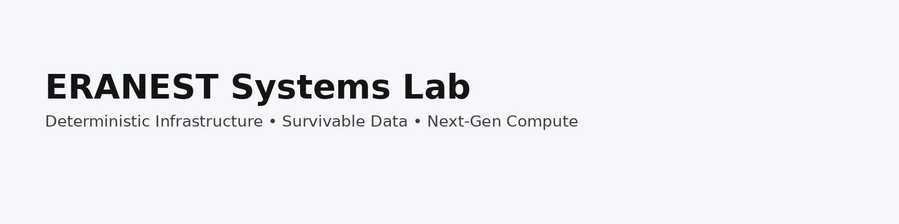
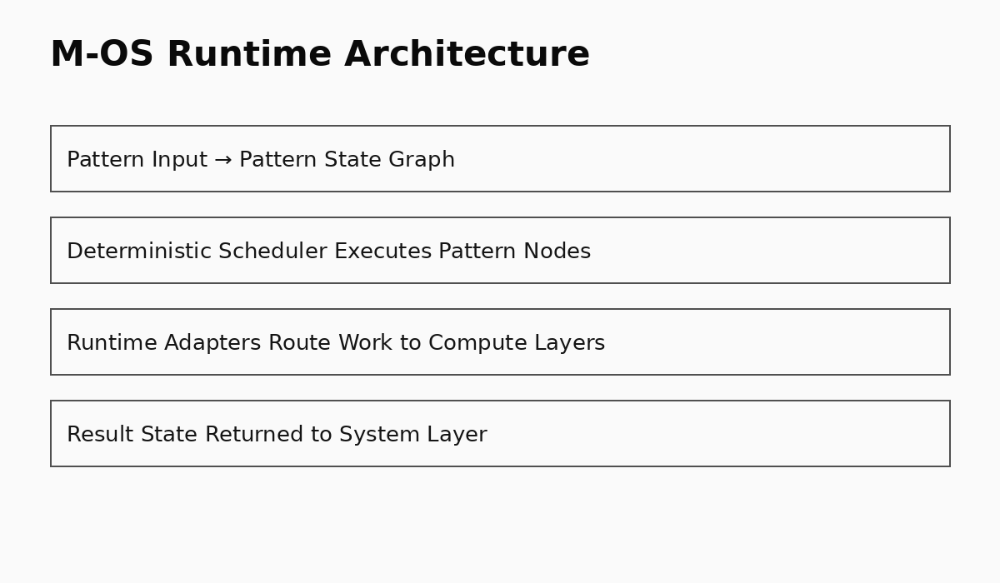
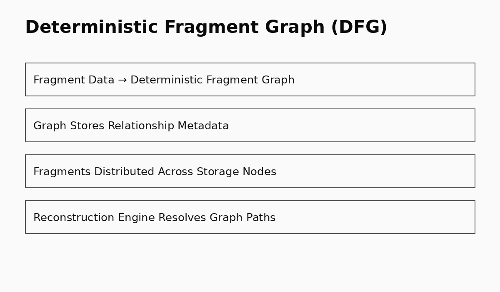
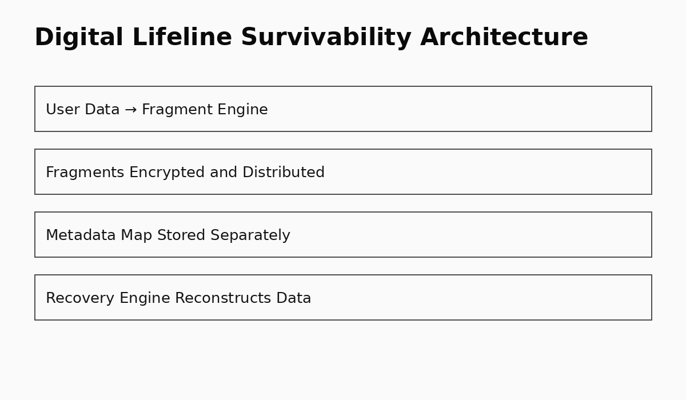

<h1 align="center">Raaj Mandale</h1>

Founder • System Architect • ERANEST Technoware Pvt Ltd

Building deterministic infrastructure, survivable data systems, and next-generation compute architectures.

🔬 Systems Research • 🧠 AI Infrastructure • 🛡 Security Architecture • ⚙️ Deterministic Compute

---

# 🔬 ERANEST Systems Lab

Engineering and research across foundational digital infrastructure.

Focus areas include:

- ⚙️ Deterministic system architectures  
- 🧩 Fragment-based data storage  
- 💾 Survivable digital infrastructure  
- 🧠 Pattern-based compute runtime  
- 🤖 AI-assisted risk intelligence  
- 🔐 Secure decision systems  

The goal is to move digital systems from:

**Fragile Software → Deterministic Infrastructure**

---

# 🧠 Core System Architecture

QBAIX
↓
M-OS Runtime
↓
Deterministic Fragment Graph (DFG)
↓
Digital Lifeline
↓
XAIAK AI
↓
XAIPT Security
↓
XLP / UNI-OS

---

# ⚡ QBAIX

Experimental compute platform exploring next-generation infrastructure combining:

- high-performance compute  
- deterministic execution models  
- scalable runtime systems  

---

# 🧠 M-OS Runtime

Pattern-based runtime architecture exploring deterministic compute behavior.

Core concepts:

- Pattern State Transition Graph  
- deterministic scheduling  
- scalable runtime execution  

Repository:

https://github.com/raajmandale/mos-runtime

---

# 🧩 Deterministic Fragment Graph (DFG)

DFG introduces a model where **data becomes a recoverable graph instead of fragile files**.

File
↓
Fragment
↓
Graph
↓
Deterministic Reconstruction

Repository:

https://github.com/raajmandale/dfg-demo-lab

---

# 💾 Digital Lifeline

Distributed survivability system ensuring that data remains recoverable even if the original device is lost or destroyed.

Core principles:

- fragment-based storage  
- multi-location survivability  
- metadata-driven reconstruction  
- zero full file storage on servers  

Repository:

https://github.com/raajmandale/digital-lifeline

---

# 🤖 AI Systems

## 🛡 XAIAK — Risk Intelligence AI

AI system designed to help detect digital risk exposure before damage occurs.

Focus areas:

- contextual alerts  
- decision risk detection  
- AI-assisted guidance  

Repository:

https://github.com/raajmandale/xaiak-riskbrief-ai

---

# 🔐 Security Systems

## XAIPT — Decision Gate Security

Dual-device authority architecture designed to protect sensitive operations such as payments.

Execution model:

HOLD → APPROVE → EXECUTE

Repository:

https://github.com/raajmandale/xaipt-decision-gate

---

# 📚 Research & Publications

Research artifacts available through:

Zenodo  
https://zenodo.org/records/18798774

Working papers and articles will be published on:

- Dev.to  
- Medium  
- Hashnode  

Topics include:

- deterministic infrastructure  
- fragment storage architectures  
- survivable digital systems  
- pattern-based compute runtime  

---

# 📊 GitHub Activity

---

# 👁 Profile Visitors

---

# 🌐 Connect

GitHub  
https://github.com/raajmandale

Research artifacts  
https://zenodo.org/records/18798774