<p align="center">
  
</p>

<h1 align="center">Raaj Mandale</h1>

<p align="center">
Founder • Systems Architect • Independent DeepTech Researcher
</p>

<p align="center">
Pune, India | Eranest Technoware Pvt Ltd
</p>

---

## Canonical Profile

Official public profile connecting projects, publications, research identity, and open-source proof artifacts:

🌐 https://raajmandale.in/raaj-mandale.html

---

## Research Identity

- ORCID: https://orcid.org/0009-0005-9810-1655  
- Wikidata: https://www.wikidata.org/wiki/Q139570902  
- OpenAlex: https://openalex.org/A5127026877  

---

## Featured Research Papers

### QBAIX + Mandale-OS  
DOI: https://doi.org/10.5281/zenodo.18798774

### Mandale-OS (M-OS)  
DOI: https://doi.org/10.5281/zenodo.19793309

### XPADI — Survivability-Governed Data Systems  
DOI: https://doi.org/10.5281/zenodo.19500143

---

## Flagship Systems

### XPADI Shield
Software-first data survivability and verified recovery system.

Repository:  
https://github.com/raajmandale/XPADI_Proof_Engine_V1

---

### M-OS — Execution Reactor
Flagship proof repository for consequence-aware execution and pattern-aware reuse.

Repository:  
https://github.com/raajmandale/mos-mee-execution-reactor

---

### XLifelineAI
Self-healing AI memory resilience research.

Repository:  
https://github.com/raajmandale/XLifelineAI

---

## Systems Direction

```text
Deterministic Compute
→ Survivable Data
→ Controlled Execution
```

---

## Selected Open Repositories

- https://github.com/raajmandale/mos-runtime  
- https://github.com/raajmandale/mos-parameter-golf  
- https://github.com/raajmandale/dfg-demo-lab  

---

## Additional Publication

Mahira-X

Amazon Kindle:  
https://www.amazon.in/dp/B0GX3N1TG9

Project page:  
https://raajmandale.in/mahira-x.html

---

## Company

Eranest Technoware Pvt Ltd  
ICC Devi IT Park, Pune

Email: info@eranest.in  
Mobile: +91 9823999855

---

## External Links

- Website: https://raajmandale.in  
- GitHub: https://github.com/raajmandale  
- Zenodo: https://zenodo.org/records/19500143  
- ORCID  
- Wikidata  
- OpenAlex  

---

## Notes

This GitHub profile mirrors the canonical profile and acts as a public reference layer connecting research, code, and publications.

---

<p align="center">
Deterministic Systems • Survivability • Execution Intelligence
</p>