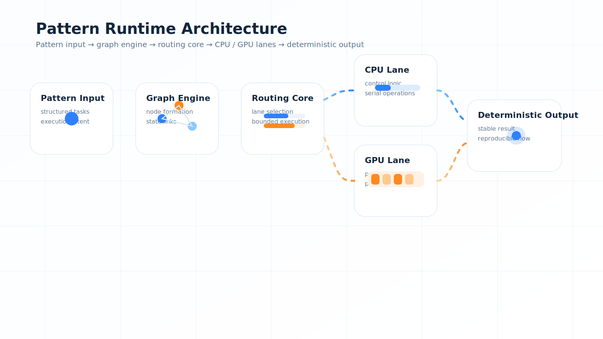

<p align="center">
  
</p>

<h1 align="center">Raaj Mandale</h1>

<p align="center">
System Architect • Founder • ERANEST Systems Lab
</p>

<p align="center">
Building deterministic infrastructure, survivable data systems, and next-generation compute architectures.
</p>

---

## ⚡ Systems Direction

```text
Deterministic Compute → Survivable Data → Controlled AI Execution
```

---

## 🧠 Core Stack

```text
QBAIX
↓
M-OS Runtime
↓
DFG (Reconstruction Engine)
↓
Digital Lifeline
↓
XAIAK (Risk Intelligence)
↓
XAIPT (Decision Gate)
```

---

## 🔬 Flagship Systems

### ⚙️ Compute

* M-OS Runtime → Pattern-based execution
* Parameter Golf → Context compression

### 💾 Survivability

* DFG → Rebuild after failure
* Digital Lifeline → Distributed recovery

### 🛡️ AI + Security

* XAIAK → Risk intelligence
* XAIPT → Approval-based execution

---

## 🎬 System View

<p align="center">
  
</p>

---

## ⚡ Philosophy

> Systems should not just run.
> They should **survive, reconstruct, and enforce outcomes.**

---

## 🚀 Explore

* https://github.com/raajmandale/mos-runtime
* https://github.com/raajmandale/dfg-demo-lab
* https://github.com/raajmandale/mos-parameter-golf

---

## 🌐 Research

https://zenodo.org/records/18798774

---

<p align="center">
⚡ Deterministic Systems • Survivability • Pattern Compute
</p>
