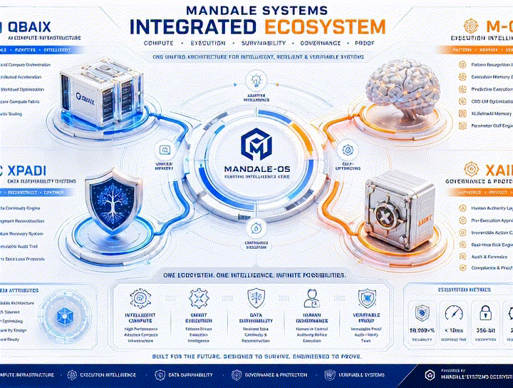
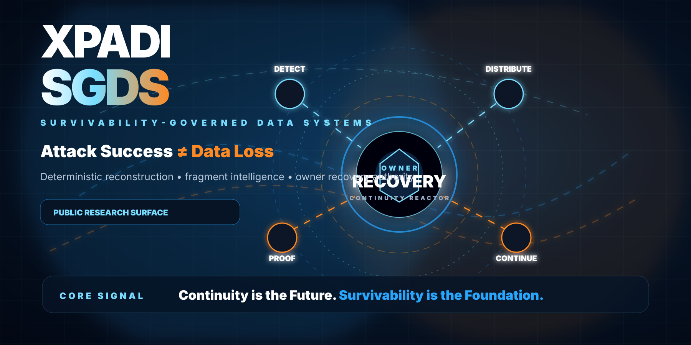

# Raaj Mandale

<h3 align="center">
Founder building systems across AI compute, execution memory, survivability, governance, and proof systems.
</h3>

Pune, India • Eranest Technoware Pvt Ltd

---

## 🌐 Runtime Civilization Surface

🔗 <a href="https://raajmandale.in">Founder Website</a> •
💻 <a href="https://github.com/raajmandale">GitHub Root</a> •
🛡️ <a href="https://xpadi.com/proofcheck/">XPADI ProofCheck™</a> •
⚡ <a href="https://github.com/raajmandale/mandale-os">Mandale-OS</a> •
🔐 <a href="https://github.com/raajmandale/XAIPT-GUARD">XAIPT-GUARD™</a> •
🧬 <a href="https://raajmandale.github.io/XLifelineAI/">XLifelineAI Demo</a>

📄 <a href="https://orcid.org/0009-0005-9810-1655">ORCID</a> •
🌍 <a href="https://www.wikidata.org/wiki/Q139570902">Wikidata</a> •
📚 <a href="https://openalex.org/A5127026877">OpenAlex</a> •
🧾 <a href="https://zenodo.org/communities/qbaix">Zenodo Research</a>

---

## 🧭 System Architecture

  

---

## ⚡ System Overview

A unified architecture composed of core runtime systems:

- **QBAIX** → AI Compute Infrastructure Layer  
- **M-OS** → Pattern-Based Execution Intelligence  
- **XPADI** → Survivability-Governed Data Systems  
- **XAIPT** → Governance + Protected Execution Runtime  

Together:

> Compute → Execution → Survivability → Governance → Proof

This is not a collection of disconnected projects.  
It is a cohesive runtime ecosystem for next-generation computing environments.

---

## 🧠 Core Thesis

Execution does not always need to begin from zero.

Systems can:

- Detect patterns  
- Reuse prior execution  
- Survive failures  
- Protect irreversible actions  
- Prove correctness  

This work explores:

> **Reusable, survivable, governable, and verifiable execution systems**

---

## 🧾 Research Identity

**Name:** Raaj Mandale  
**Affiliation:** Eranest Technoware Pvt Ltd / Mandale Research Systems  
**Location:** Pune, India  

---

## 📄 Featured Research Papers

| Paper | Focus | DOI |
|------|------|------|
| QBAIX + Mandale-OS | AI Compute + Execution Intelligence | https://doi.org/10.5281/zenodo.18798774 |
| Mandale-OS (M-OS) | Pattern Execution Systems | https://doi.org/10.5281/zenodo.19793309 |
| XPADI — SGDS | Data Survivability Systems | https://doi.org/10.5281/zenodo.19500143 |

---

## 📚 Additional Publications

- SSRN Research Paper  
  https://papers.ssrn.com/sol3/papers.cfm?abstract_id=6573778

---

---

### ⚡ Flagship Runtime Systems

| System | Runtime |
|--------|-------|
| 🛡️ XPADI Shield™ | Repo + DOI |
| ⚡ Mandale-OS Runtime | Repo + DOI |
| 🔐 XAIPT-GUARD™ | Governance Runtime |
| 🧬 XLifelineAI | Live Runtime Demo |

---

---

---

## 🧩 Flagship Repositories

### ⚡ Core Runtime Civilization Layer

🚀 XPADI-SGDS™  
https://github.com/raajmandale/XPADI-SGDS

⚙️ Mandale-OS Runtime  
https://github.com/raajmandale/mandale-os

🧠 M-OS Execution Reactor  
https://github.com/raajmandale/mos-mee-execution-reactor

🔐 XAIPT-ROOT™  
https://github.com/raajmandale/XAIPT

🧬 XLifelineAI  
https://github.com/raajmandale/XLifelineAI

---

### 🧪 Runtime Research + Experimental Layer

🛡️ XPADI Proof Engine  
https://github.com/raajmandale/XPADI_Proof_Engine_V1

⚡ XPADI-ProofCheck  
https://github.com/raajmandale/XPADI-ProofCheck

🧠 DFG Runtime Lab  
https://github.com/raajmandale/dfg-demo-lab

⚙️ M-OS Parameter Golf  
https://github.com/raajmandale/mos-parameter-golf

🔐 XAIPT-GUARD™  
https://github.com/raajmandale/XAIPT-GUARD

📡 CRS-LM  
https://github.com/raajmandale/mos-parameter-golf/tree/main/crs-lm

---

### 🎥 Live Runtime Demonstrations

| Demo | Link |
|---|---|
| 🧬 XLifelineAI Runtime Demo | https://raajmandale.github.io/XLifelineAI/ |
| 🛡️ XPADI ProofCheck™ | https://xpadi.com/proofcheck/ |
| ⚡ Mandale-OS Runtime Surface | https://github.com/raajmandale/mandale-os |
| 🔐 XAIPT-GUARD Runtime Surface | https://github.com/raajmandale/XAIPT-GUARD |

---

## 🧠 Selected Contributions

- Pattern-based execution memory systems (Mandale-OS)  
- Survivability-governed data systems (XPADI)  
- Human-centered execution governance (XAIPT)  
- Deterministic Fragment Graph Runtime (DFG)  
- AI memory resilience systems (XLifelineAI)  

---

## 🧱 Notable Works

- XPADI Shield™  
- Mandale-OS (M-OS)  
- XAIPT-GUARD™  
- QBAIX Hybrid Compute Systems  
- Mahira-X (research-fiction publication)  

---

## 🏢 Company

Eranest Technoware Pvt Ltd  
ICC Devi IT Park, Pune  

Email: info@eranest.in  

---

## 📘 Mahira-X

Amazon Kindle  
https://www.amazon.in/dp/B0GX3N1TG9  

Website  
https://raajmandale.in/mahira-x.html  

---

## 📊 GitHub Metrics

  

  
  

  
  

---

Compute • Execution • Survivability • Governance • Proof

