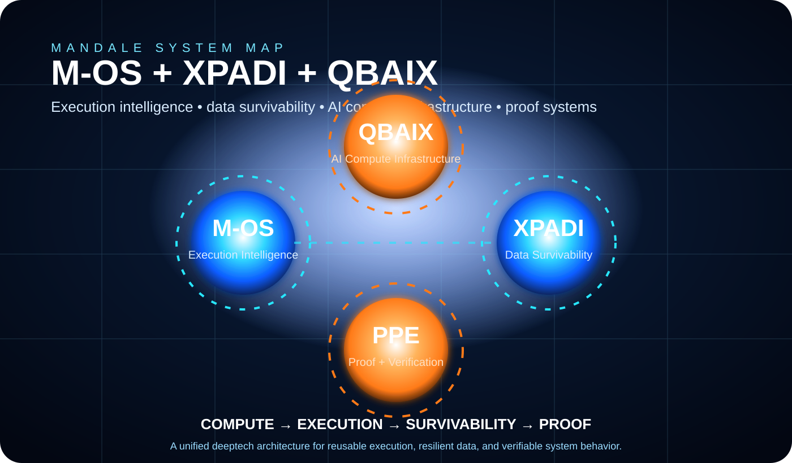

# Raaj Mandale

<h3 align="center">
Founder building systems across AI compute, execution memory, and data survivability.
</h3>

Pune, India • Eranest Technoware Pvt Ltd

## 🧭 System Architecture

  

---

## ⚡ System Overview

A unified architecture composed of three core systems:

- **QBAIX** → AI Compute Infrastructure Layer  
- **M-OS** → Pattern-Based Execution Intelligence  
- **XPADI** → Survivability-Governed Data System  

Together:

> Compute → Execution → Survivability → Proof

This is not a collection of projects.  
It is a **cohesive system stack for next-generation computing environments**.

---

## 🧠 Core Thesis

Execution does not always need to begin from zero.

Systems can:
- Detect patterns  
- Reuse prior execution  
- Survive failures  
- Prove correctness  

This work explores:

> **Reusable, survivable, and verifiable execution systems**

---

---

## 🌐 Canonical Profile

https://raajmandale.in/raaj-mandale.html

Official public profile connecting projects, publications, research identity, and proof artifacts.

---

## 🔗 Quick Links

| Resource | Link |
|---------|------|
| Website | https://raajmandale.in |
| GitHub | https://github.com/raajmandale |
| ORCID | https://orcid.org/0009-0005-9810-1655 |
| Wikidata | https://www.wikidata.org/wiki/Q139570902 |
| OpenAlex | https://openalex.org/A5127026877 |

---

## 🧾 Research Identity

**Name:** Raaj Mandale  
**Affiliation:** Eranest Technoware Pvt Ltd / Mandale Research Systems  
**Location:** Pune, India  

---

## 📄 Featured Research Papers

| Paper | Focus | DOI |
|------|------|------|
| QBAIX + Mandale-OS | AI Compute + Execution Intelligence | https://doi.org/10.5281/zenodo.18798774 |
| Mandale-OS (M-OS) | Pattern Execution Systems | https://doi.org/10.5281/zenodo.19793309 |
| XPADI — SGDS | Data Survivability Systems | https://doi.org/10.5281/zenodo.19500143 |

## 📚 Additional Publications

- SSRN Research Paper  
  https://papers.ssrn.com/sol3/papers.cfm?abstract_id=6573778

---

---

## 🚀 Flagship Systems

| System | Focus | Proof |
|--------|-------|-------|
| XPADI Shield | Data Survivability | Repo + DOI |
| M-OS Execution Reactor | Execution Intelligence | Repo + DOI |
| XLifelineAI | Memory Resilience | Repo |

---

---

## 🧩 Flagship Repositories

🚀 XPADI Shield  
https://github.com/raajmandale/XPADI_Proof_Engine_V1

⚙️ M-OS Execution Reactor  
https://github.com/raajmandale/mos-mee-execution-reactor

🧠 XLifelineAI  
https://github.com/raajmandale/XLifelineAI

**Additional:**
- https://github.com/raajmandale/mos-runtime  
- https://github.com/raajmandale/mos-parameter-golf  
- https://github.com/raajmandale/dfg-demo-lab  

---

## 🧠 Selected Contributions

- Pattern-based execution memory systems (Mandale-OS)  
- Survivability-governed data systems (XPADI)  
- Deterministic Fragment Graph (DFG)  
- AI memory resilience experiments (XLifelineAI)  

---

## 🧱 Notable Works

- XPADI Shield™  
- Mandale-OS (M-OS)  
- QBAIX Hybrid Compute Systems  
- Mahira-X (research-fiction publication)  

---

## 🏢 Company

Eranest Technoware Pvt Ltd  
ICC Devi IT Park, Pune  

Email: info@eranest.in  

---

## 📘 Mahira-X

Amazon Kindle  
https://www.amazon.in/dp/B0GX3N1TG9  

Website  
https://raajmandale.in/mahira-x.html  

---

## 🌍 External References

- Zenodo: https://zenodo.org/records/19500143  
- ORCID: https://orcid.org/0009-0005-9810-1655  
- Wikidata: https://www.wikidata.org/wiki/Q139570902  
- OpenAlex: https://openalex.org/A5127026877  

---

## 📊 GitHub Metrics

  
  

---

Compute • Execution • Survivability • Proof

